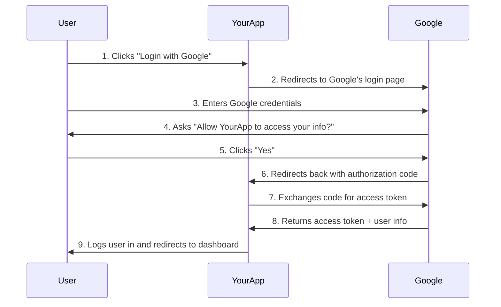

# The Ultimate Guide to Node.js & Google OAuth with Passport.js

## Introduction

This guide will take you through implementing "Log in with Google" functionality in a Node.js Express application using Passport.js. By the end of this guide, you'll understand not just how to implement OAuth, but why each piece works the way it does.

## Section 1: The 'Big Picture' - What is OAuth 2.0?

### Why OAuth 2.0 Exists

Imagine you want to let users log into your app using their Google accounts. The naive approach would be to ask usßers for their Google username and password. But this is terrible for security! Users would have to trust your app with their Google credentials, and Google would have no way to know which app is making requests on behalf of users.

OAuth 2.0 solves this by introducing a "delegation" system. Instead of sharing passwords, users give your app a special "access token" that proves Google has authorized your app to act on their behalf.

### The OAuth 2.0 "Dance"

Here's what happens when a user clicks "Login with Google":



### The Key Players

- **Resource Owner** (User): The person who owns the Google account
- **Client** (Your App): The application requesting access to user data
- **Authorization Server** (Google): Verifies the user's identity and issues tokens
- **Resource Server** (Also Google): Stores the user's data (profile, email, etc.)

**Why this is secure**: Your app never sees the user's Google password. Google controls the entire authentication process and only gives your app a limited token.

## Section 2: Project Setup & Installation

### Required Dependencies

```bash
npm install express express-session passport passport-google-oauth20 dotenv
```

### Why Each Package is Needed

- **`express`**: The web framework for Node.js. We need routes to handle the OAuth flow.

- **`express-session`**: Manages user sessions. **Why crucial?** OAuth authentication is useless if we can't remember the user is logged in between requests. Sessions store a "session cookie" in the user's browser that identifies them on subsequent visits.

- **`passport`**: The authentication middleware for Express. **Why use it?** OAuth is complex with many steps. Passport abstracts away the complexity and provides a consistent interface for different authentication strategies.

- **`passport-google-oauth20`**: The Google-specific strategy for Passport. **Why separate package?** Passport is modular - you can add strategies for Facebook, Twitter, GitHub, etc., without bloating your app with unused code.

- **`dotenv`**: Loads environment variables from a `.env` file. **Why essential?** Your Google Client Secret must never be committed to version control. Environment variables keep secrets... secret.

### Project Structure

Your project should look like this:

```
my-app/
├── backend/
│   ├── server.js          # Main application file
│   ├── .env              # Environment variables (never commit!)
│   ├── package.json
│   └── models/
│       └── userModel.js  # User database model
└── frontend/
    └── ...
```

## Section 3: Configuring Google Credentials

### How to Get Google OAuth Credentials

1. **Go to [Google Cloud Console](https://console.cloud.google.com/)**

2. **Create a new project** (or select existing one)

3. **Enable the Google+ API**:

   - Navigation Menu → APIs & Services → Library
   - Search "Google+ API" and enable it

4. **Create OAuth 2.0 Credentials**:

   - APIs & Services → Credentials
   - Create Credentials → OAuth 2.0 Client ID
   - Application type: Web application
   - Authorized redirect URIs: `http://localhost:5000/auth/google/callback`

5. **Copy your Client ID and Client Secret**

### Why These Credentials Matter

- **Client ID**: This is like your app's "username" with Google. It's public and identifies your application. Google uses this to show users which app is requesting access ("YourApp wants to access your Google profile").

- **Client Secret**: This is like your app's "password" with Google. **NEVER expose this publicly!** Only your server should know this. Google uses this to verify that requests are actually coming from your app, not an imposter.

- **Redirect URI**: This tells Google where to send users after they authenticate. **It must match exactly** what you configure in Google Console. If it doesn't match, Google will reject the authentication for security reasons.

### Environment Variables Setup

Create a `.env` file in your backend directory:

```env
GOOGLE_CLIENT_ID=your_actual_client_id_here
GOOGLE_CLIENT_SECRET=your_actual_client_secret_here
SESSION_SECRET=some_random_string_for_session_encryption
PORT=5000
```

**Security Note**: Add `.env` to your `.gitignore` file immediately! Never commit secrets to version control.

## Section 4: Initializing Passport & Sessions

### The Middleware Stack

```javascript
const express = require("express");
const session = require("express-session");
const passport = require("passport");
require("dotenv").config();

const app = express();

// 1. Session middleware (MUST come first)
app.use(
  session({
    secret: process.env.SESSION_SECRET,
    resave: false,
    saveUninitialized: true,
    cookie: {
      secure: false, // Set to true in production with HTTPS
      maxAge: 24 * 60 * 60 * 1000, // 24 hours
    },
  })
);

// 2. Passport initialization (MUST come after session)
app.use(passport.initialize());

// 3. Passport session support (MUST come after passport.initialize())
app.use(passport.session());
```

### Why This Order Matters

Think of middleware as a pipeline. Each request flows through this pipeline in order:

1. **Session Middleware**: Creates `req.session` object and reads the session cookie from the browser. If this doesn't run first, Passport won't be able to store/retrieve user data.

2. **Passport Initialize**: Sets up Passport's internal machinery. Adds methods like `req.login()` and `req.logout()` to the request object.

3. **Passport Session**: Looks at the session data and automatically calls `deserializeUser()` to attach the full user object to `req.user`. **Without this, `req.user` would be undefined on every request!**

### Session Configuration Explained

- **`secret`**: Used to encrypt session cookies. If someone gets your secret, they can forge sessions! Keep it random and private.

- **`resave: false`**: Don't save session if nothing changed. Prevents unnecessary database writes.

- **`saveUninitialized: true`**: Save new sessions even if empty. Needed for OAuth flow to work properly.

- **`cookie.secure`**: Only send cookies over HTTPS in production. Set to `false` for local development.

- **`maxAge`**: How long the login lasts. After 24 hours, user must log in again.

## Section 5: The Google Strategy

### Complete Google Strategy Implementation

```javascript
const GoogleStrategy = require("passport-google-oauth20").Strategy;

passport.use(
  new GoogleStrategy(
    {
      clientID: process.env.GOOGLE_CLIENT_ID,
      clientSecret: process.env.GOOGLE_CLIENT_SECRET,
      callbackURL: "/auth/google/callback",
    },
    async (accessToken, refreshToken, profile, done) => {
      try {
        // Check if user already exists in our database
        let existingUser = await User.findOne({ googleId: profile.id });

        if (existingUser) {
          // User already exists, log them in
          return done(null, existingUser);
        }

        // Create new user in our database
        const newUser = new User({
          googleId: profile.id,
          name: profile.displayName,
          email: profile.emails[0].value,
          avatar: profile.photos[0].value,
        });

        const savedUser = await newUser.save();
        return done(null, savedUser);
      } catch (error) {
        return done(error, null);
      }
    }
  )
);
```

### Breaking Down the Strategy

**Why we need a "strategy"**: Passport supports many authentication methods (local username/password, Facebook, Twitter, etc.). Each method has different requirements. Strategies encapsulate the specific logic for each authentication method.

**The Callback URL**:

- Must **exactly match** what you configured in Google Console
- This is where Google will redirect users after they authenticate
- Google appends an authorization code to this URL

**The Verify Callback Function**:

This function runs **after** Google successfully authenticates the user. Google calls it with four parameters:

- **`accessToken`**: A token your app can use to make API calls to Google on behalf of the user. You might store this to access their Gmail, Calendar, etc.

- **`refreshToken`**: Used to get new access tokens when they expire. Not always provided (only on first login).

- **`profile`**: The user's Google profile information. This is the goldmine - their name, email, profile picture, etc.

- **`done`**: A callback function you must call to tell Passport you're finished. Call `done(null, user)` for success or `done(error, null)` for errors.

### The Profile Object

When Google sends back the user's profile, it looks like this:

```javascript
{
    id: '108976267896571930072',
    displayName: 'John Doe',
    name: { familyName: 'Doe', givenName: 'John' },
    emails: [{ value: 'john.doe@gmail.com', verified: true }],
    photos: [{ value: 'https://lh3.googleusercontent.com/...' }],
    provider: 'google'
}
```

**Why check if user exists**: We don't want to create duplicate users every time someone logs in. Check by `googleId` first, create only if new.

## Section 6: User Serialization (The Tricky Part!)

### The Code

```javascript
// Serialize user for storing in session
passport.serializeUser((user, done) => {
  done(null, user._id); // Only store the user ID in session
});

// Deserialize user from session                
passport.deserializeUser(async (id, done) => {
  try {
    const user = await User.findById(id);
    done(null, user); // Attach full user object to req.user
  } catch (error) {
    done(error, null);
  }
});
```

### Why Serialization is Necessary

Imagine you have 1000 users logged in simultaneously. If you stored each user's complete profile data in their session, you'd quickly run out of memory. Instead, we use a clever trick:

**Serialization**: "Pack the user into something small for storage"

- When a user logs in, we only store their `user._id` in the session
- It's like giving someone a claim ticket at a coat check

**Deserialization**: "Unpack the full user from the small stored thing"

- On every subsequent request, Passport looks at the session, finds the `user._id`, and fetches the full user data from the database
- It's like taking the claim ticket back to get your coat

### The Flow in Action

1. User logs in → Strategy runs → Returns full user object
2. `serializeUser()` runs → Stores only `user._id` in session
3. User makes another request → `deserializeUser()` runs → Looks up full user by ID → Attaches to `req.user`

**Why this is efficient**: Sessions store tiny IDs instead of large user objects. Database lookups are fast, and you always have fresh user data (in case their profile changed).

### Common Mistake

```javascript
// ❌ DON'T DO THIS - Stores entire user object in session
passport.serializeUser((user, done) => {
  done(null, user); // BAD: Large memory usage, stale data
});

// ✅ DO THIS - Store only the ID
passport.serializeUser((user, done) => {
  done(null, user._id); // GOOD: Minimal memory, fresh data
});
```

## Section 7: Creating the Auth Routes

### The Two Essential Routes

```javascript
// Route 1: Start the OAuth flow
app.get(
  "/auth/google",
  passport.authenticate("google", {
    scope: ["profile", "email"],
  })
);

// Route 2: Handle the OAuth callback
app.get(
  "/auth/google/callback",
  passport.authenticate("google", {
    successRedirect: "/dashboard",
    failureRedirect: "/login",
  })
);
```

### Route 1: The "Login Button" Route (`/auth/google`)

**What happens when someone visits this route**:

1. Passport looks up the 'google' strategy we configured
2. Redirects the user to Google's OAuth server
3. The URL looks like: `https://accounts.google.com/oauth/authorize?client_id=...&scope=profile+email&response_type=code&redirect_uri=...`

**The `scope` parameter**:

- Tells Google what information we want access to
- `'profile'`: Basic profile info (name, profile picture)
- `'email'`: User's email address
- Users will see: "YourApp wants to access your basic profile info and email address"

**Why this route does a redirect**: We're not handling authentication ourselves - we're sending the user to Google to authenticate. This is the core principle of OAuth: delegate authentication to the experts.

### Route 2: The "Callback" Route (`/auth/google/callback`)

**What happens here**:

1. Google redirects the user back to this URL after authentication
2. The URL includes an authorization code: `/auth/google/callback?code=abc123...`
3. Passport automatically exchanges this code for an access token
4. Passport calls our verify callback function with the user's profile
5. If successful, redirects to `/dashboard`; if failed, redirects to `/login`

**Why we need success and failure redirects**:

- Authentication can fail (user denies permission, network issues, etc.)
- We need to handle both cases gracefully
- Success: Welcome the user to your app
- Failure: Let them try again or use a different login method

### Complete Auth Routes with Error Handling

```javascript
// Logout route
app.get("/logout", (req, res) => {
  req.logout((err) => {
    if (err) {
      return next(err);
    }
    res.redirect("/");
  });
});

// Check authentication status
app.get("/auth/status", (req, res) => {
  if (req.isAuthenticated()) {
    res.json({
      authenticated: true,
      user: {
        name: req.user.name,
        email: req.user.email,
        avatar: req.user.avatar,
      },
    });
  } else {
    res.json({ authenticated: false });
  }
});
```

## Section 8: Protecting Your Routes

### Creating Authentication Middleware

```javascript
// Middleware to check if user is logged in
function isLoggedIn(req, res, next) {
  if (req.isAuthenticated()) {
    return next(); // User is logged in, continue to next middleware/route
  }
  // User is not logged in, redirect to login page
  res.redirect("/auth/google");
}

// Alternative: Return JSON for API endpoints
function requireAuth(req, res, next) {
  if (req.isAuthenticated()) {
    return next();
  }
  res.status(401).json({ error: "Authentication required" });
}
```

### Using the Middleware

```javascript
// Protect a route - only logged-in users can access
app.get("/dashboard", isLoggedIn, (req, res) => {
  res.json({
    message: `Welcome to your dashboard, ${req.user.name}!`,
    user: req.user,
  });
});

// Protect an API endpoint
app.get("/api/profile", requireAuth, (req, res) => {
  res.json({
    profile: {
      name: req.user.name,
      email: req.user.email,
      avatar: req.user.avatar,
    },
  });
});

// Public route - anyone can access
app.get("/", (req, res) => {
  if (req.isAuthenticated()) {
    res.send(
      `Hello ${req.user.name}! <a href="/dashboard">Go to Dashboard</a> | <a href="/logout">Logout</a>`
    );
  } else {
    res.send('Welcome! <a href="/auth/google">Login with Google</a>');
  }
});
```

### How `req.isAuthenticated()` Works

This method is added by Passport and checks two things:

1. **Does the session exist?** (Is there a session cookie?)
2. **Is there a user in the session?** (Did `deserializeUser` successfully load a user?)

**Behind the scenes**:

```javascript
// Passport essentially does this:
req.isAuthenticated = function () {
  return !!(
    this.session &&
    this.session.passport &&
    this.session.passport.user
  );
};
```

### Different Approaches for Different App Types

**For Server-Rendered Apps** (Traditional web apps):

- Use `isLoggedIn` middleware that redirects to login page
- Good for apps that render HTML on the server

**For APIs/Single Page Applications**:

- Use `requireAuth` middleware that returns JSON error
- Frontend handles the 401 response by showing login UI

## Section 9: Complete Working Example

### Full Server Implementation

```javascript
const express = require("express");
const session = require("express-session");
const passport = require("passport");
const GoogleStrategy = require("passport-google-oauth20").Strategy;
require("dotenv").config();

const app = express();

// Mock database (in real app, use MongoDB/PostgreSQL)
const users = [];
let userIdCounter = 1;

// Session configuration
app.use(
  session({
    secret: process.env.SESSION_SECRET,
    resave: false,
    saveUninitialized: true,
    cookie: {
      secure: false,
      maxAge: 24 * 60 * 60 * 1000,
    },
  })
);

// Passport initialization
app.use(passport.initialize());
app.use(passport.session());

// Google OAuth Strategy
passport.use(
  new GoogleStrategy(
    {
      clientID: process.env.GOOGLE_CLIENT_ID,
      clientSecret: process.env.GOOGLE_CLIENT_SECRET,
      callbackURL: "/auth/google/callback",
    },
    (accessToken, refreshToken, profile, done) => {
      // Check if user exists
      let user = users.find((u) => u.googleId === profile.id);

      if (user) {
        return done(null, user);
      }

      // Create new user
      user = {
        id: userIdCounter++,
        googleId: profile.id,
        name: profile.displayName,
        email: profile.emails[0].value,
        avatar: profile.photos[0].value,
      };

      users.push(user);
      return done(null, user);
    }
  )
);

// Serialization
passport.serializeUser((user, done) => {
  done(null, user.id);
});

passport.deserializeUser((id, done) => {
  const user = users.find((u) => u.id === id);
  done(null, user);
});

// Middleware
function isLoggedIn(req, res, next) {
  if (req.isAuthenticated()) {
    return next();
  }
  res.redirect("/auth/google");
}

// Routes
app.get("/", (req, res) => {
  if (req.isAuthenticated()) {
    res.send(`
            <h1>Hello ${req.user.name}!</h1>
            
            <br>
            <a href="/dashboard">Dashboard</a> | 
            <a href="/logout">Logout</a>
        `);
  } else {
    res.send('<h1>Welcome!</h1><a href="/auth/google">Login with Google</a>');
  }
});

app.get(
  "/auth/google",
  passport.authenticate("google", { scope: ["profile", "email"] })
);

app.get(
  "/auth/google/callback",
  passport.authenticate("google", {
    successRedirect: "/",
    failureRedirect: "/login-failed",
  })
);

app.get("/dashboard", isLoggedIn, (req, res) => {
  res.json({
    message: `Welcome to your dashboard!`,
    user: {
      name: req.user.name,
      email: req.user.email,
      avatar: req.user.avatar,
    },
  });
});

app.get("/logout", (req, res) => {
  req.logout((err) => {
    if (err) {
      console.error("Logout error:", err);
    }
    res.redirect("/");
  });
});

app.get("/login-failed", (req, res) => {
  res.send('Login failed. <a href="/">Try again</a>');
});

const PORT = process.env.PORT || 5000;
app.listen(PORT, () => {
  console.log(`Server running on http://localhost:${PORT}`);
});
```

## Section 10: Testing Your Implementation

### Manual Testing Steps

1. **Start your server**: `npm start`
2. **Visit**: `http://localhost:5000`
3. **Click "Login with Google"** - Should redirect to Google
4. **Authenticate with Google** - Should redirect back to your app
5. **Verify you're logged in** - Should see welcome message with your name
6. **Visit protected route**: `http://localhost:5000/dashboard`
7. **Test logout** - Click logout, should redirect to home page
8. **Test protection** - Visit dashboard while logged out, should redirect to Google

### Common Issues and Solutions

**"Error: Failed to serialize user into session"**

- Fix: Implement `passport.serializeUser()` correctly

**"Error: Failed to deserialize user out of session"**

- Fix: Implement `passport.deserializeUser()` correctly
- Make sure the ID you serialize can be used to find the user

**"Error: Cannot GET /auth/google/callback"**

- Fix: Make sure the callback URL in Google Console matches exactly

**"Error: invalid_client"**

- Fix: Check your Client ID and Client Secret in `.env` file
- Make sure `.env` file is being loaded (`require('dotenv').config()`)

**Session not persisting**

- Fix: Make sure session middleware comes before passport middleware
- Check that you have a SESSION_SECRET in your `.env` file

## Section 11: Security Best Practices

### Environment Variables Security

```bash
# .env file
GOOGLE_CLIENT_ID=your_client_id
GOOGLE_CLIENT_SECRET=your_client_secret
SESSION_SECRET=a_very_random_string_here
NODE_ENV=development
```

**Never commit `.env` to git**:

```bash
echo ".env" >> .gitignore
```

### Production Considerations

```javascript
// Production session config
app.use(
  session({
    secret: process.env.SESSION_SECRET,
    resave: false,
    saveUninitialized: false, // Don't save empty sessions in production
    cookie: {
      secure: process.env.NODE_ENV === "production", // HTTPS only in production
      httpOnly: true, // Prevent XSS attacks
      maxAge: 24 * 60 * 60 * 1000,
    },
  })
);
```

### Rate Limiting

```javascript
const rateLimit = require("express-rate-limit");

// Limit auth attempts
const authLimiter = rateLimit({
  windowMs: 15 * 60 * 1000, // 15 minutes
  max: 5, // 5 attempts per window
  message: "Too many authentication attempts",
});

app.use("/auth", authLimiter);
```

## Conclusion

Congratulations! You now understand the complete flow of Google OAuth with Passport.js. You've learned:

- **The OAuth 2.0 "dance"** and why it's secure
- **How Passport strategies work** and why they're modular
- **Session management** and why serialization is necessary
- **Route protection** and middleware patterns
- **Security best practices** for production applications

The key insight is that OAuth is about **delegation** - your app never handles passwords directly. Instead, you delegate authentication to Google (the expert) and receive a token that proves the user has authorized your app.

This pattern works for any OAuth provider (Facebook, GitHub, Twitter, etc.) - just swap out the strategy and configuration details.

### Next Steps

1. **Add a real database** (MongoDB with Mongoose, or PostgreSQL with Sequelize)
2. **Implement user profiles** with additional user data
3. **Add email notifications** when users sign up
4. **Implement role-based access control** (admin, user, etc.)
5. **Add refresh token handling** for long-term API access
6. **Implement CSRF protection** for additional security

Remember: OAuth is complex, but understanding the "why" behind each step makes it much clearer. Each piece serves a specific security or functionality purpose in the authentication flow.
